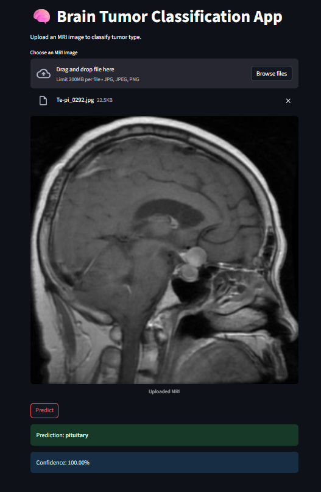

# Brain Tumor Detector 🧠

A deep learning‑powered web app for detecting and classifying brain tumors from MRI scans using **Streamlit** + **PyTorch (ResNet50)**.

---

## Demo / Preview



---

## Table of Contents

- [Features](#features)  
- [Project Structure](#project-structure)  
- [Model Details](#model-details)  
- [Installation](#installation)  
- [Running the App](#running-the-app)  
- [Usage](#usage)  
- [Results & Metrics](#results--metrics)  
- [Future Improvements](#future-improvements)  
- [Contributing](#contributing)  
- [License](#license)  

---

## Features

- Upload MRI scalp images in `.jpg`, `.jpeg`, or `.png` formats.  
- Classifies into four categories:  
  - **Glioma**  
  - **Meningioma**  
  - **Pituitary**  
  - **No Tumor**  
- Shows prediction along with confidence score (probability).  
- Clean, interactive UI via Streamlit.  
- Separation of concerns:  
  - `main.py` handles UI & user interaction  
  - `prediction_helper.py` handles model loading & inference  

---

## Project Structure

```
brain-tumour-detector/
├── main.py
├── prediction_helper.py
├── Tumor_Prediction.pth       # Trained model weights
├── requirements.txt
├── Demo.png                   # UI preview/image
├── README.md
├── LICENSE
└── .gitignore
```

- **main.py**: Launches Streamlit app  
- **prediction_helper.py**: Model inference utilities  
- **Tumor_Prediction.pth**: Saved model file  
- **requirements.txt**: All package dependencies  

---

## Model Details

- Base architecture: **ResNet50** (pre‑trained on ImageNet)  
- Input image size: 224×224 (or resized to match model)  
- Output classes: 4 (Glioma, Meningioma, Pituitary, No‑Tumor)  
- Preprocessing: resizing, normalization to match ImageNet’s mean & std  
- Inference: model loads weights from `Tumor_Prediction.pth`  

*(If you have details like dataset size, training/validation split, epochs, accuracy/loss curves, add them here.)*

---

## Installation

1. Clone the repo:

   ```bash
   git clone https://github.com/ShaileshLambode/brain-tumour-detector.git
   cd brain-tumour-detector
   ```

2. Create a virtual environment (optional but recommended):

   ```bash
   python3 -m venv venv
   source venv/bin/activate    # On Windows: venv\Scripts\activate
   ```

3. Install dependencies:

   ```bash
   pip install -r requirements.txt
   ```

---

## Running the App

```bash
streamlit run main.py
```

This will open the web app in your default browser (usually at `localhost:8501` unless otherwise specified).

---

## Usage

- Once the app is running, upload an MRI image of the brain.  
- Click **Predict**.  
- The app will output:  
  1. The predicted tumor type (Glioma, Meningioma, Pituitary, or No Tumor)  
  2. The confidence score (percentage) for that prediction  

---

## Results & Metrics

| Metric              | Value        |
|----------------------|----------------|
| Number of classes    | 4              |
| Model Architecture   | ResNet50       |
| Data types           | MRI images (.jpg/.png) |
| Expected Accuracy*   | 98% |

\* To be filled once evaluation is done (validation/test accuracy, confusion matrix, etc.)

---

## Future Improvements

- Provide more detailed performance metrics: precision, recall, F1‑score, confusion matrix review.  
- Expand dataset (diverse images: different scanner machines, noise, image orientations).  
- Add data augmentation to improve robustness.  
- Possibly add explainability (Grad‑CAM or heatmaps showing where the model looks).  
- Clip upload sizes / error & input validation.  
- Optionally package into a Docker container for easy deployment.  

---

## Contributing

Contributions are welcome! If you’d like to help:

1. Fork the repository  
2. Create a new branch (e.g. `feature/my‑feature`)  
3. Make your changes + add tests if applicable  
4. Commit & push your changes  
5. Raise a Pull Request with a clear description of what you changed  

---

## License

This project is released under the **Apache 2.0** License. See the [LICENSE](LICENSE) file for details.  
